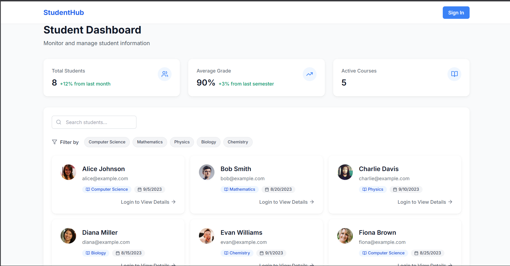

# Student Dashboard

A modern, responsive React application for managing student information with Firebase authentication.



## Features

- **Student Management**
  - View list of students with detailed information
  - Add new students with form validation
  - Filter students by course
  - View individual student profiles

- **Authentication**
  - Secure Firebase authentication
  - Protected routes for sensitive operations
  - Email/password login and registration

- **Responsive Design**
  - Mobile-first approach
  - Smooth animations and transitions
  - Modern, clean UI with Tailwind CSS

##  Technologies Used

- React 18 with TypeScript
- Firebase Authentication
- Tailwind CSS for styling
- Framer Motion for animations
- React Router for navigation
- React Hook Form for form handling
- Axios + Mock Adapter for API simulation
- Lucide React for icons

## 🏃‍♂️ Running the Project

1. Clone the repository
2. Install dependencies:
   ```bash
   npm install
   ```
3. Start the development server:
   ```bash
   npm run dev
   ```

## Requirements Completed

✅ View list of students (Mock API simulation)  
✅ Add new student with Firebase authentication  
✅ Form validation  
✅ Filter by course  
✅ Responsive design  
✅ Network calls to Firebase  

## Bonus Features

1. **Advanced Animations**
   - Smooth page transitions
   - Loading states
   - Interactive UI elements

2. **Enhanced UI Components**
   - Custom loader
   - Error states
   - Empty states

3. **Data Visualization**
   - Student statistics
   - Course distribution
   - Grade analytics
